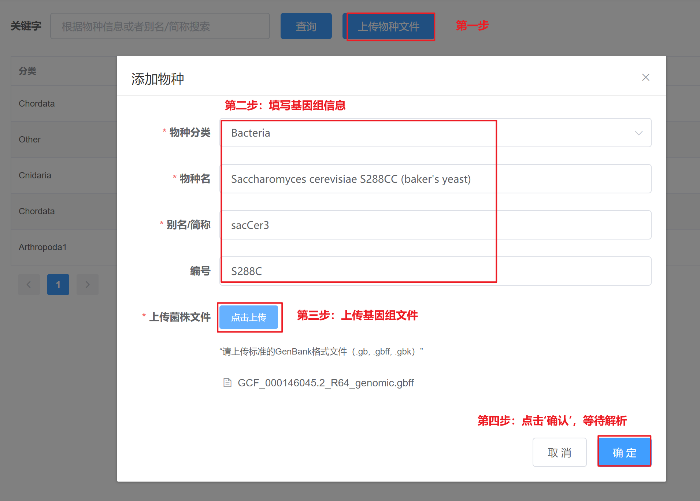

---
author:
  name: LING ld
  link: 
  avatar: static/avatar-girl.png

label: Add New Genomes
icon: upload
order: B
---

# 新增基因组文件

登录[CASdesign网站](http://124.71.187.96:8081/)后，如果发现`菌株列表`中没有感兴趣的物种，您可以在网站左侧工具栏点击进入`新增物种`页面。点击`上传物种文件`，根据弹出框的提示，填写新增物种基因组文件的基本信息，主要包括：

* 物种分类：从物种分类列表中选择一个合适的，如`Bacteria`；

* 物种名：物种详细名称，可以有空格，如`copy_Saccharomyces cerevisiae S288CC`；

* 别名或简称：物种名的别名或简称，不可以有空格，如果有多个单词，请以英文输入法的`_`分割，如`sacCer3`；

* 物种编号：物种编号，非必填项，用于区分比如菌株的不同株系，如`S288C`。

填写好物种基本信息后，从您本地电脑里选择感兴趣物种的标准GenBank文件（主要包括`gb`、`gbk`、`gbff`格式）。

上传成功后，请耐心等待30s左右，后台程序将会对新基因组文件进行解析。解析任务会将GenBank中注释的所有基因位点信息提取出来，以便用户通过[搜索基因名来搜寻编辑区域](/instruction/select-targets/#targrt-genes)。此外，还将分析GenBank中各染色体的信息，以便用户通过[自定义染色体编号及起始终止位点靶向选择编辑区域](/instruction/select-targets/#target-genomic-regions)。

!!! **注意**

:sparkles: 1）`别名/简称_物种编号`（如`sacCer3_S288C`）将作为程序唯一识别锁定一个基因组文件的信息，所以不允许有重复。

!!!