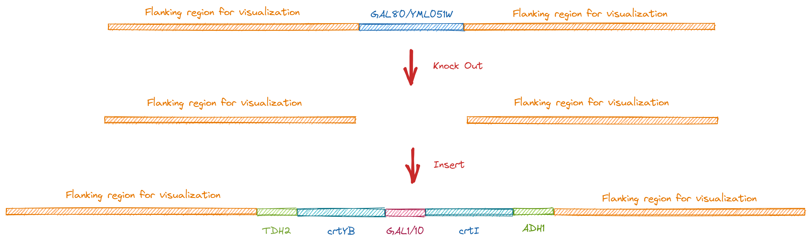
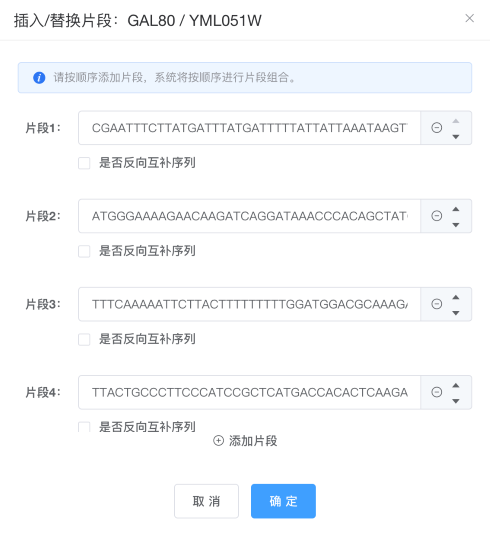

---
author:
  name: LING ld
  link: 
  avatar: ./static/avatar-girl.png

label: Knock Out/Replacement
icon: package-dependencies
order: F
---

# 基因敲除/替换



## 1. 生物学意义

在`GAL80`位置处插入5个片段，可以组成用半乳糖启动子P~GAL1~、P~GAL10~表达crtI和crtYB基因的表达元件。

将该表达元件直接替换到GAL80基因的位置上，一方面可以将酿酒酵母内半乳糖诱导型启动子直接变为组成型启动子，使P~GAL1~、P~GAL10~在较廉价的葡萄糖内也可以保持高表达。另一方面，在酿酒酵母内直接添加了两个异源基因crtI和crtYB，使酿酒酵母获得可以生产胡萝卜素的能力。

## 2. 具体操作

### 1）选择基因编辑区

在基因编辑页面中，鼠标双击`Linear Map`中代表`GAL80`基因ORF的蓝色箭头（或者输入基因的起始终止位点）来选中编辑区域；然后点击`插入/替换`按钮，进入插入序列设置界面。

### 2）设置插入/替换序列

将已准备好的插入片段粘贴到输入框。


+++ **插入片段1**
```
CGAATTTCTTATGATTTATGATTTTTATTATTAAATAAGTTATAAAAAAAATAAGTGTATACAAATTTTAAAGTGACTCTTAGGTTTTAAAACGAAAATTCTTATTCTTGAGTAACTCTTTCCTGTAGGTCAGGTTGCTTTCTCAGGTATAGCATGAGGTCGCTCTTATTGACCACACCTCTACCGG
```
+++ **插入片段2**
```
ATGGGAAAAGAACAAGATCAGGATAAACCCACAGCTATCATCGTGGGATGTGGTATCGGTGGAATCGCCACTGCCGCTCGTCTTGCTAAAGAAGGTTTCCAGGTCACGGTGTTCGAGAAGAACGACTACTCCGGAGGTCGATGCTCTTTAATCGAGCGAGATGGTTATCGATTCGATCAGGGGCCCAGTTTGCTGCTCTTGCCAGATCTCTTCAAGCAGACATTCGAAGATTTGGGAGAGAAGATGGAAGATTGGGTCGATCTCATCAAGTGTGAACCCAACTATGTTTGCCACTTCCACGATGAAGAGACTTTCACTtTTTCAACCGACATGGCGTTGCTCAAGCGGGAAGTCGAGCGTTTTGAAGGCAAAGATGGATTTGATCGGTTCTTGTCGTTTATCCAAGAAGCCCACAGACATTACGAGCTTGCTGTCGTTCACGTCCTGCAGAAGAACTTCCCTGGCTTCGCAGCATTCTTACGGCTACAGTTCATTGGCCAAATCCTGGCTCTTCACCCCTTCGAGTCTATCTGGACAAGAGTTTGTCGATATTTCAAGACCGACAGATTACGAAGAGTCTTCTCGTTTGCAGTGATGTACATGGGTCAAAGCCCATACAGTGCGCCCGGAACATATTCCTTGCTCCAATACACCGAATTGACCGAGGGCATCTGGTATCCGAGAGGAGGCTTTTGGCAGGTTCCTAATACTCTTCTTCAGATCGTCAAGCGCAACAATCCCTCAGCCAAGTTCAATTTCAACGCTCCAGTTTCCCAGGTTCTTCTCTCTCCTGCCAAGGACCGAGCGACTGGTGTTCGACTTGAATCCGGCGAGGAACATCACGCCGATGTTGTGATTGTCAATGCTGACCTCGTTTACGCCTCCGAGCACTTGATTCCTGACGATGCCAGAAACAAGATTGGCCAACTGGGTGAAGTCAAGAGAAGTTGGTGGGCTGACTTAGTTGGTGGAAAGAAGCTCAAGGGAAGTTGCAGTAGTTTGAGCTTCTACTGGAGCATGGACCGAATCGTGGACGGTCTGGGCGGACACAATATCTTCTTGGCCGAGGACTTCAAGGGATCATTCGACACAATCTTCGAGGAGTTGGGtCTCCCAGCCGATCCTTCCTTTTACGTGAACGTTCCCTCGCGAATCGATCCTTCTGCCGCTCCCGAAGGCAAAGATGCTATCGTCATTCTTGTGCCGTGTGGCCATATCGACGCTTCGAACCCTCAAGATTACAACAAGCTTGTTGCTCGGGCAAGGAAGTTTGTGATCCAaACGCTTTCCGCCAAGCTTGGACTTCCCGACTTTGAAAAAATGATTGTGGCAGAGAAGGTTCACGATGCTCCCTCTTGGGAGAAAGAATTtAACCTCAAGGACGGAAGCATCTTGGGACTGGCTCACAACTTTATGCAAGTTCTTGGTTTCAGGCCGAGCACCAGACATCCCAAGTATGACAAGTTGTTCTTTGTCGGGGCTTCGACTCATCCCGGAACTGGGGTTCCCATCGTCTTGGCTGGAGCCAAGTTAACTGCCAACCAAGTTCTCGAATCCTTTGACCGATCCCCAGCTCCAGATCCCAATATGTCACTCTCCGTACCATATGGAAAACCTCTCAAATCAAATGGAACGGGTATCGATTCTCAGGTCCAGCTGAAGTTCATGGATTTGGAGAGATGGGTATACCTTTTGGTgTTGTTGATTGGGGCCGTGATCGCTCGATCCGTTGGTGTTCTTGCTTTCTGA
```
+++ **插入片段3**
```
TTTCAAAAATTCTTACTTTTTTTTTGGATGGACGCAAAGAAGTTTAATAATCATATTACATGGCATTACCACCATATACATATCCATATCTAATCTTACTTATATGTTGTGGAAATGTAAAGAGCCCCATTATCTTAGCCTAAAAAAACCTTCTCTTTGGAACTTTCAGTAATACGCTTAACTGCTCATTGCTATATTGAAGTACGGATTAGAAGCCGCCGAGCGGGCGACAGCCCTCCGACGGAAGACTCTCCTCCGTGCGTCCTCGTCTTCACCGGTCGCGTTCCTGAAACGCAGATGTGCCTCGCGCCGCACTGCTCCGAACAATAAAGATTCTACAATACTAGCTTTTATGGTTATGAAGAGGAAAAATTGGCAGTAACCTGGCCCCACAAACCTTCAAATTAACGAATCAAATTAACAACCATAGGATGATAATGCGATTAGTTTTTTAGCCTTATTTCTGGGGTAATTAATCAGCGAAGCGATGATTTTTGATCTATTAACAGATATATAAATGGAAAAGCTGCATAACCACTTTAACTAATACTTTCAACATTTTCAGTTTGTATTACTTCTTATTCAAATGTCATAAAAGTATCAACAAAAAATTGTTAATATACCTCTATACTTTAACGTCAAGGAG
```
+++ **插入片段4**
```
TTACTGCCCTTCCCATCCGCTCATGACCACACTCAAGACTTTCCGTACTCTCCTCCATCCGGCAACTGTCCTTCTCTCTCCGACGTCTCCTTTCCAAACGACTTTGATCTCTCGGCCGATCAGTAGGTAGCTCGCGCAAGCCGCTCGCATTCCCGCTTGAACCTCGGTAGGAAGTCGGTCAATTCCCTTATAAGAATGTTTGGCAAGATCCTCTGCGTAGGCGACTAATGGAAGCGAGTACGTCTTCCATTCGAACCGGAAGCTTTCTGAGGCGTTTGAAGATGGTAATGTGGACGAAGGAGATAGACTGAGGAGTTTGTCGAAATCTTGAGGCCGAGGTTCCGTCCAATCAGTCGGGATCGCAAGCTTTGATTCATCCCGAAGACCAAAGAATGAGAGTGGTAGGTAAAATCTCCCTTCTGTTGCGTCCCCTTTAATGTCCCTAGCAATGTTCACCAACTGAAGGGCAGTTCCCATCTCTCGGCTTGCCACTAACACAGCTTCTCTTTCTTCTATGGTGGCAGGGACCTGACTTGGTGCACTTGCCCAAGAGACATAGACCAATAGCTCGGCGACTGAGCCTGCTACACATAGACCATAGTCCAGCAAGTCAGCTGTGGTCTCGATAGGCGTCTTCCGAGCCTGGACTGCCTCTGTCGATAAGGGAAAGATAAGATCAGTGGTGTATCCTCTAAGGAGTTCGTCGAGTGGGTATCGAGGGATCAGCCCTTGCAACTTAGCGAGCAACCTGAAGGCGAAATGGTATTGAACGGGAACCCTTTCGGTAAGGAATTGAACGAGCTCGGCAGGCGAGAGCGAAGGAGGAGGCGGGAGGGGATACATTCCCGTGGGTCGGGAAGGGTGCGAAGGAGGAAGTAAAGGCGAAGAAAGGATCTTGTCAGGTTGCGAAGGGTGTAGCGGGGGCCCAAATAGTAGGGTAAGAAAATCGGAGACCATGTCAATTGTGGCATGCGGGTTGGAAGATACTTCAGGAGAGTCGATAAGATCATCAGTCACCCGGCAGAATGCGTATAGTCCAACCAGCCTCTCCCTAACTTCGCTAGGAAATCCAGCCGAGGCAACAAAAAAGCTCCGGCTCTTTTTCTCCAACAACTTGACTGCCAGTTCCAAGTCACGTTTTGGCTGAGAAGAGTATGGTCGGCTGCTAAAAAACAGGGAGAGCACAGGCGGTGTAATGAGGGGAAATGAAGATGGCATCTTTTTGTTGCCATAAATAGTTCGACCGTGTAGCAGGTATAGGGCCTGAGTATGATCGCAGGCAGACAGACCCAGAACAATCATTAGATTCGTCAGTAAGAAGAACATAGCTTCCTCAATGGGTAGTACACCTCCAAGCCTCCACCCTACAATCTTCTCATCGTTGATCGACCAAGAGTCTTGACCGACAGCAACATAATCTACCCAAATCAGATACACCGTCGGGATCATGATTGCTGCAATAGTTGACTTTGCTCGGCCACTTTTCCAATCGAAAGCATATTCGCCTGATAATGCTGCCAAGAGCATGGTAGGTGGGGTGATGAGTAAGGAGAGTGCCCGCATGTAGAAGTAGTGATCTGTCACGAGCGGGTCGGGCGATGGGCTGGGGTGAGCGGTAAATAGGTAGATAATGGGCAGAGGGATGAGCGCCTTGAGCGCGAGAGAAAGGGCGGACGATCTAGTCTTGGGAAGCGCGAGAGATGGGAGAAGGTGCCTAGTTGCCAAGACGTAGACCAAGCCGGTGATTACGGTTTGAATGACAAAGAAAGCGTACTCTTCATATGGAACATCTAGAAACGTTCCAAACACGCCTTGGCCACTCTCCGCTGATGGATATGTCCATGCGCCATTTCTGATGATCCATGAGTCCCATGGTGTGGTTGCACTAAACGCAATAAATACGAGGATCGATATTTTGTAGATGTCAAATTTTGTCAAAATCGGGGAAGTGAGCAGGCCGAGAAGACCAAGAATTGGGAGAGTATAGATCAGATGGATCTGGTAATATGCGAGAGCCGTCAT
```
+++ **插入片段5**
```
GCGAAAAGCCAATTAGTGTGATACTAAGTGCTTTATCGAAAATCCGTGATGCCGGTCCTTCAGGCATCAAATTTCAGTGGCCTAATTATTCACAGAGTTCTCATGTGACAAGTATTGATGATAGTAGTGTCAGTTATGCTTCAGGTTATGTTACTATAGGATAATGATCACGGCTAAAACGGTCGAATGTAAGCATATATCTTTCGATTGTATAATTGTTCCCAAATACTACAGCATCTCAAGGAAAAAAAAACAAAAACTTCCAAAAAAATCGAATCCCTGAGGAATCTTTAATACATTTTCAATCTATTTAAGTTTTATAAACGTGTATATGAGATGTCATGAGCATGAATTATTAATAATAAAAACTAAATCATTAAAGTAACTTAAGGAGTTAAAT
```
+++

在此界面，用户可以进行序列顺序调整、选择是否将序列插入反向互补链、删除多余插入框等操作。设置好插入序列后，点击“确定”回到编辑页面。

