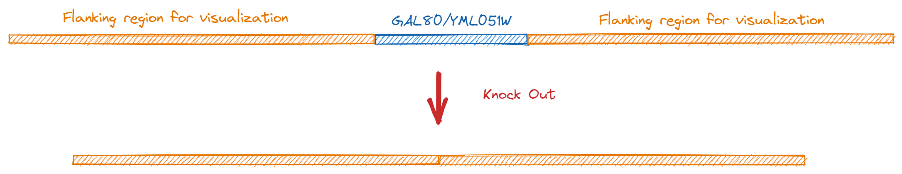

---
author:
  name: LING ld
  link: 
  avatar: /static/avatar-girl.png

label: Knock Out
icon: package-dependents
order: E
---

# 基因敲除

## 1. 生物学意义

通过敲除`GAL80`基因，可使酵母内半乳糖诱导表达的高活性启动子成为组成型表达，活性也可保持在较高水平，这样使酿酒酵母在利用较廉价的葡萄糖同时也可保持较高的异源蛋白表达水平。

## 2. 具体操作

在基因编辑页面中，鼠标双击`Linear Map`中代表`GAL80`基因ORF的蓝色箭头（或者输入基因的起始终止位点）来选中编辑区域；然后点击`敲除`按钮，执行序列敲除操作；点击`结果页`按钮，进入到结果展示页面。

