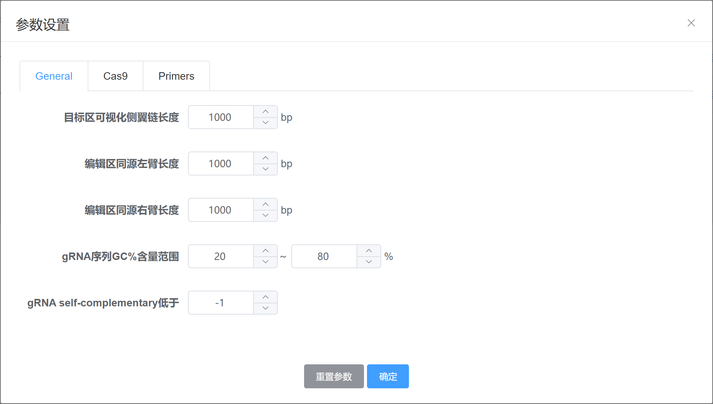
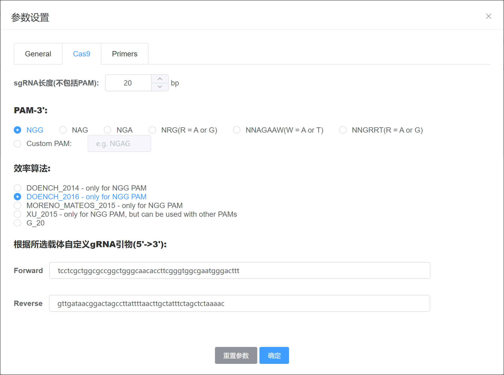
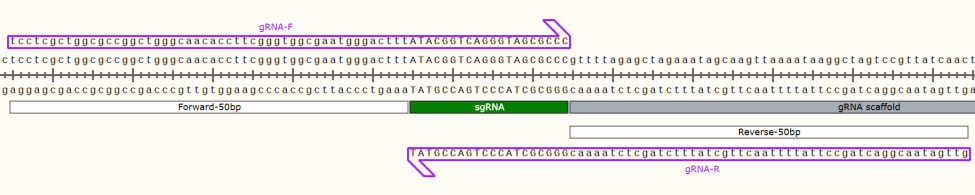
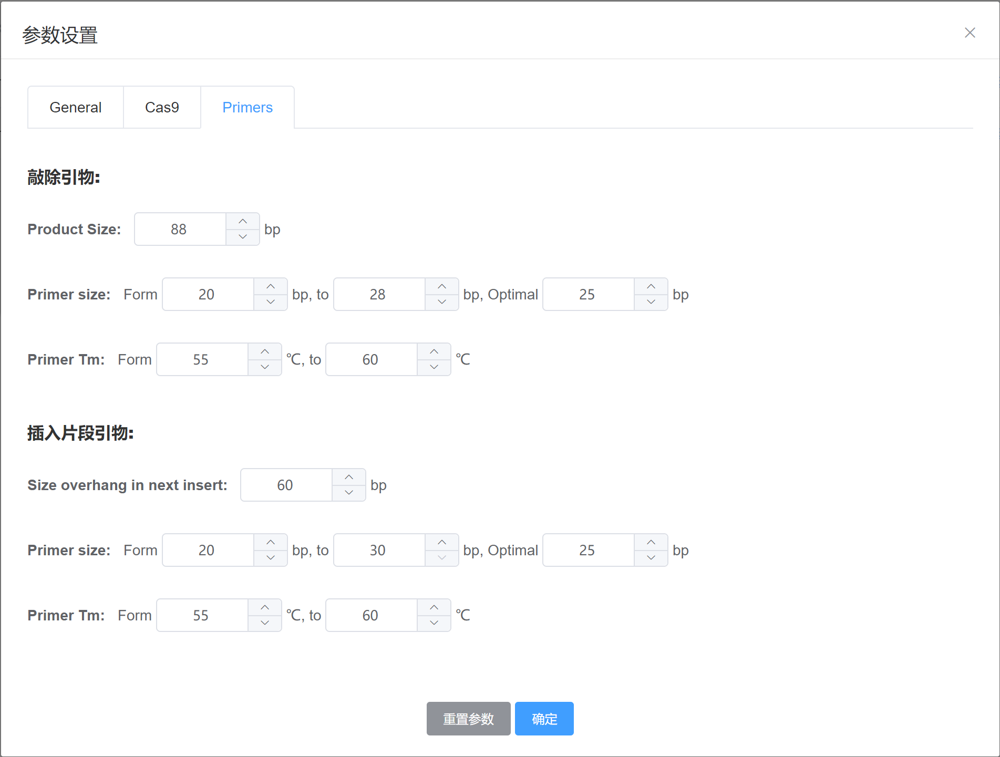
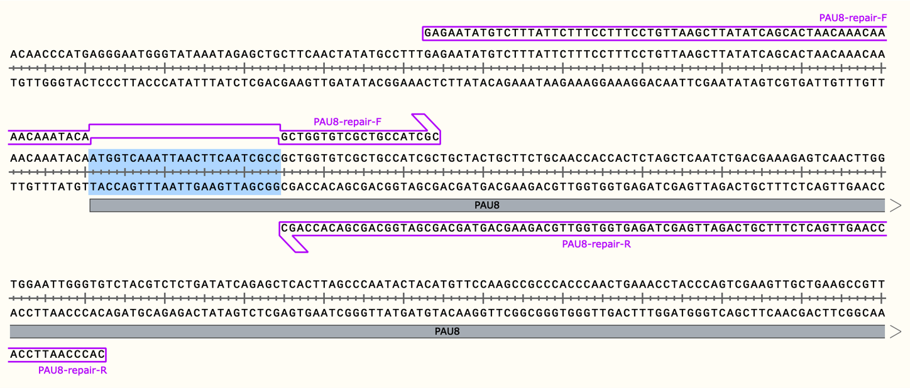
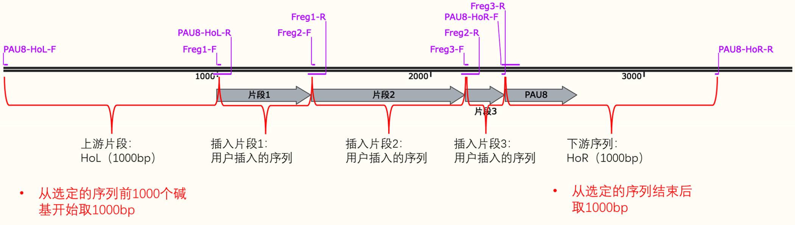

---
author:
  name: LING ld
  link: 
  avatar: ../static/avatar-girl.png

label: Parameters
icon: code-square
order: D
---

# 参数设置

登录进入[CASdesign网站](http://124.71.187.96:8081/)，在`物种列表`页，首先进行如下操作：

* 选择一个感兴趣的基因组

* 在`选择位置`弹出框中选择目标编辑位点

* 在弹框下方，设置使用`CRISPR/Cas9`或`CRISPR/Cpf1`基因编辑工具后，点击`参数设置`可对更多参数进行适当调整。

各参数的详细解释见下文。

## 1. General

### 1）目标区域可视化侧翼链长度

如上图所示，此参数定义了可视化交互编辑界面中，在目标位点（蓝色区域）两侧要额外显示的序列长度（橙色区域）。此参数是为了在交互编辑的时候，允许用户选择目标位点以外的区域进行基因敲除、基因插入/替换操作。

!!! **默认值**

1000 bp
!!!

### 2）编辑区同源左、右臂长度

同源修复的左、右同源臂是发生同源双交换引入外源片段时必须的片段，是为了在引入外源片段时细胞发生同源重组修复过程中可以精准定位到特定位置并引入外源片段的引导者片段。它是在进行`基因敲除/替换`具体编辑操作的时候，`敲除/替换`区两侧的指定区间，需要根据该指定的同源区长度进行编辑区同源左右臂引物的计算。

如图所示的黑色线段表示引物：

* HoL-F: 同源左臂forward引物；

* HoL-R: 同源左臂reverse引物；

* HoR-F: 同源右臂forward引物；

* HoR-R: 同源右臂reverse引物。

!!! **默认值**

1000 bp
!!!

### 3）gRNA序列GC含量

设置gRNA序列GC含量（%）范围，筛选符合的gRNA。

!!! **默认值**

最小GC(%)含量：20%

最大GC(%)含量：80%
!!!

### 4）gRNA self-complementary

[CHOPCHOP](https://academic.oup.com/nar/article/47/W1/W171/5491735)算法中考虑了[Thyme等人的self-complementarity score研究](https://pubmed.ncbi.nlm.nih.gov/27282953/)，该方法计算了sgRNA内以及sgRNA与骨架之间潜在的4 bp茎数。因此，用户可以使用该选项选择避免具有自身互补性的sgRNA。

!!! **默认值**

-1 (no filter)
!!!

## 2. Cas9 or Cpf1

根据用户选择的不同CRISPR效应蛋白（Cas9或Cpf1），用户可对应分别设置：

* a. sgRNA长度：Cas9模式下默认长度为20 bp，Cpf1模式下默认长度为24 bp；

* b. PAM序列：Cas9模式下默认的PAM序列为`NGG`，Cpf1模式下默认是PAM序列为`TTCN`；

* c. gRNA效率算法（详情见下文）：Cas9模式下默认算法是`Doench et al. 2016 - only for NGG PAM`，Cpf1模式下默认算法是`Kim et al. 2018`；

* d. gRNA载体引物（详情见下文）：页面上默认提供的是基于CRISPR/Cas9的p426_Cas9_gRNA-ARS106a载体。

### 1）效率算法

CRISPR sgRNA可以按2个标准进行排名：

* a. **效率**：特定sgRNA促进切割的可能性;

* b. **特异性**：sgRNA结合脱靶位点的可能性。

根据实验研究，CHOPCHOP的初始版本提供了两个简单的效率指标:

* a. sgRNA的GC含量（理想的是介于40％和80％之间）；

* b. sgRNA是否在位置20处含有G。

自从CHOPCHOP发布以来，针对不同编辑模式下的gRNA效率评分已发展了越来越多的算法模型。使用这些方法，CHOPCHOP可以使用特定算法对每个sgRNA进行评分，在结果中，该分数被报告为“`效率分数（Efficiency Score）`”。

### 2）自定义gRNA引物片段

在实验中，gRNA片段需要插入合适的载体骨架中以构建CRISPR/Cas9或CRISPR/Cpf1表达载体，根据gRNA在载体中的插入位置指定gRNA上下游50bp的片段，以在结果页输出一对gRNA引物。

以使用`p426_Cas9_gRNA-ARS106a`载体为例，如下图所示：

* 已知gRNA在载体中的插入位置在`gRNA-scafold`上游;
* 页面参数设置中指定gRNA上（Forward）下（Reverse）游50bp的长度（图中`白色`标注的区域）；
* Forward为正义链（Top Strand）5'->3'片段；
* Reverse为负义链（Bottom Strand）5'->3'片段；
* 根据改参数设置，最终在结果页会输出`紫色`区域示意的gRNA引物对。

!!!warning 注意！！！
需要根据您实际使用的载体骨架更改这两个参数；

网页默认设置的两个片段来自`p426_Cas9_gRNA-ARS106a`载体，它是基于`CRISPR/Cas9`对`酵母`进行基因编辑时常用的pCut载体工具之一。

[pCut质粒工具包可以从Addgene获取。](https://www.addgene.org/kits/mukhopadhyay-pcut-toolkit/#kit-contents)
!!!

## 3. Primers

### 1）敲除引物参数设置

* a. 结果页中，敲除的引物名为`编辑位点名-repair-F`和`编辑位点名-repair-R`。其中，`F`和`R`分别表示`Forward`和`Reverse`；

* b. 默认情况下，`F`的组成为引物总碱基88个（可通过`product size`更改），编辑位置后20-28 bp序列内（可通过`primer size`更改）Tm在55-60度（可通过`primer TM`更改）之间的序列（如不能达到该要求，直接取后25 bp序列）；

* c. 默认情况下，`R`的组成为，编辑位置的后88个序列（可通过`product size`更改）。

### 2）插入片段引物参数设置

* a. 结果页中，插入/替换的引物名为：`编辑位点名-HoL/R-F/R`，`Frag1-F/R`，`Frag2-F/R`……`Frag(n)-F/R`。其中，`n`为用户输入的片段数；

* b. HoL，同源左臂：默认取选定的区域前1000个序列（由`General`下`编辑区同源左臂长度`控制）。HoL-F为开始的30 bp内（可通过`primer size`更改）Tm在55-60度（可通过`primer TM`更改）的序列（如不能达到该要求，直接取后25个序列） ，HoL-R为结束的30 bp内Tm在55-60度的序列（如不能达到该要求，直接取后25个序列） +片段1前60 bp（可通过`size overhang in next insert`更改）；

* c. HoR，同源右臂：默认取选定的区域后1000个序列（由`General`下`编辑区同源右臂长度`控制）。HoR-F为片段n的最后60 bp+开始的30 bp内Tm在55-60度的序列（如不能达到该要求，直接取后25个序列）序列，HoR-R为结束的30 bp内Tm在55-60度的序列；

* d. 片段1：Frag1-F为开始的30 bp内Tm在55-60度的序列，Frag1-R为结束的30 bp内Tm在55-60度的序列（如不能达到该要求，直接取后25个序列） +片段2前60 bp；

* e. 片段2：Frag2-F为开始的30 bp内Tm在55-60度的序列，Frag2-R为结束的30 bp内Tm在55-60度的序列（如不能达到该要求，直接取后25个序列） +片段3前60 bp；

* f. 片段3：Frag3-F为开始的30 bp内Tm在55-60度的序列，Frag3-R为结束的30 bp内Tm在55-60度的序列（如不能达到该要求，直接取后25个序列） +片段4前60 bp；

* g. 片段4：Frag4-F为开始的30 bp内Tm在55-60度的序列，Frag4-R为结束的30 bp内Tm在55-60度的序列；

* h. …………

* i. 如此类推，最后一个片段的规则为取开始的30 bp内Tm在55-60度的序列为F，结束的30 bp内Tm在55-60度的序列为R。
