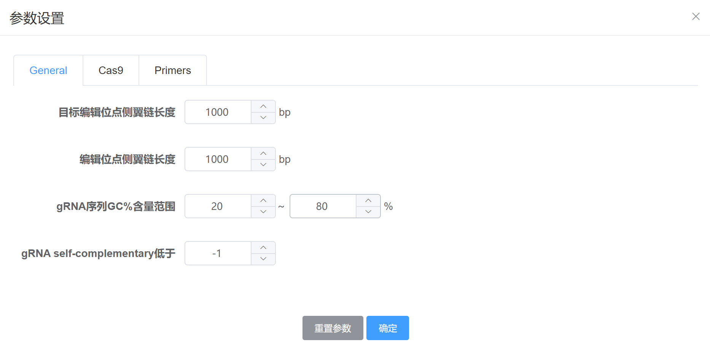

---
author:
  name: LING ld
  link: 
  avatar: ../static/avatar-girl.png

label: Parameters
icon: code-square
order: D
---

# 参数设置

登录进入[CASdesign网站](http://124.71.187.96:8081/)，在`物种列表`页，首先进行如下操作：

* 选择感兴趣的基因组

* 在`位置选择`弹出框中选择感兴趣的编辑位点

* 在`位置选择`弹出框最下方，可选择使用CRISPR的`Cas9`或`Cpf1`编辑模式进行设计，同时可点击`参数设置`进行具体设置。

各参数的详细解释见下文。

!!! **示例**

以下参数设置都以此位点为例:

:sparkles: 1）选择`sacCer3_S288C`基因组。

:sparkles: 2）目标位点选择基因`GAL80/YML051W`（等同于自定义目标位点为`chr13`，起始位点`171594`，终止位点`172901`)。

!!!

## General

### 1）目标区域可视化侧翼链

如上图所示，此参数定义了可视化交互编辑界面中，在目标位点（蓝色区域）两侧要额外显示的序列长度（橙色区域）。此参数是为了在交互编辑的时候，允许用户选择目标位点以外的区域进行基因敲除、基因插入/替换的操作。

!!! **默认值**

1000 bp
!!!

### 2）目标编辑区同源臂区间

在进行`基因敲除/替换`编辑操作的时候，需要根据指定的同源区间进行编辑区同源左右臂引物的计算。

### 3）gRNA序列GC%含量

### 4）gRNA self-complementary

## Cas9 or Cpf1

### 1）sgRNA长度

### 2）PAM-3' (Cas9) 或 5'-PAM (Cpf1)

### 3）效率算法

### 4）gRNA引物片段

## Primers

### 1）敲除引物参数设置

### 2）插入片段引物参数设置

