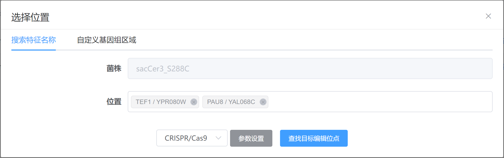
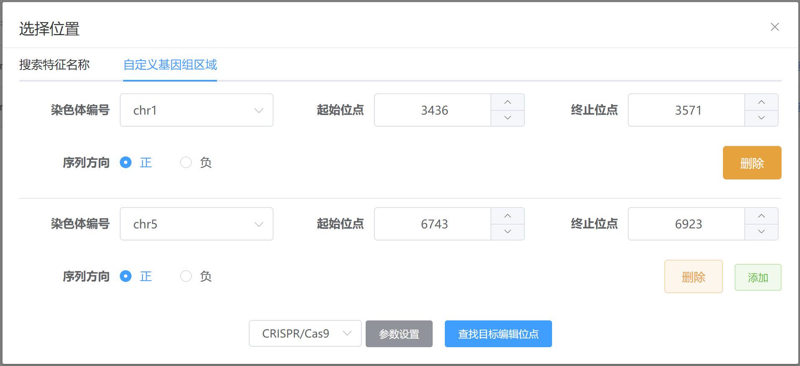

---
author:
  name: LING ld
  link: 
  avatar: ../static/avatar-girl.png

label: Select Targets
icon: multi-select
order: C
---

# 选择目标编辑区域

登录进入[CASdesign网站](http://124.71.187.96:8081/)，在左侧菜单栏点击进入`物种列表`，点击感兴趣基因组信息后的`编辑基因`，将弹出`选择位置`的窗口，软件将提供两种选择目标编辑区的方式：

* :zap: 通过搜索位点名称，包括基因名、Locus标签名、[表征位点名](/instruction/verified-Sites.md)等检索编辑区域（[Target named sites](/instruction/select-targets/#1-targrt-named-sites)）；

* :zap: 通过指定染色体编号、起始终止位点自定义编辑区域（[Target genomic regions](/instruction/select-targets/#2-target-genomic-regions)）。

## 1. Targrt named sites

* 在`位置`检索框内，输入该基因组中的`基因名`、`locus`编号或[`表征位点名`](/instruction/verified-Sites.md)；

* 允许选择多个位点。

## 2. Target genomic regions

* 选择`染色体编号`、输入`起始位点`和`终止位点`以确定编辑区域；

* 可以设置目标区域序列的方向，当设置为`负`时，在可视化编辑界面将展示负义链（Bottom Strand）5'-> 3' 的序列；

* 允许设置多个基因区间。

!!! **提示**

:sparkles: 1）上述两种目标区选择方式允许混合使用，所有位点将一并在可视化编辑界面进行展示；

:sparkles: 2）自定义基因组区域时，终止位点的坐标应大于等于起始位点的坐标；

:sparkles: 3）自定义基因组区域时，边界坐标不能超出染色体区域范围。

!!!