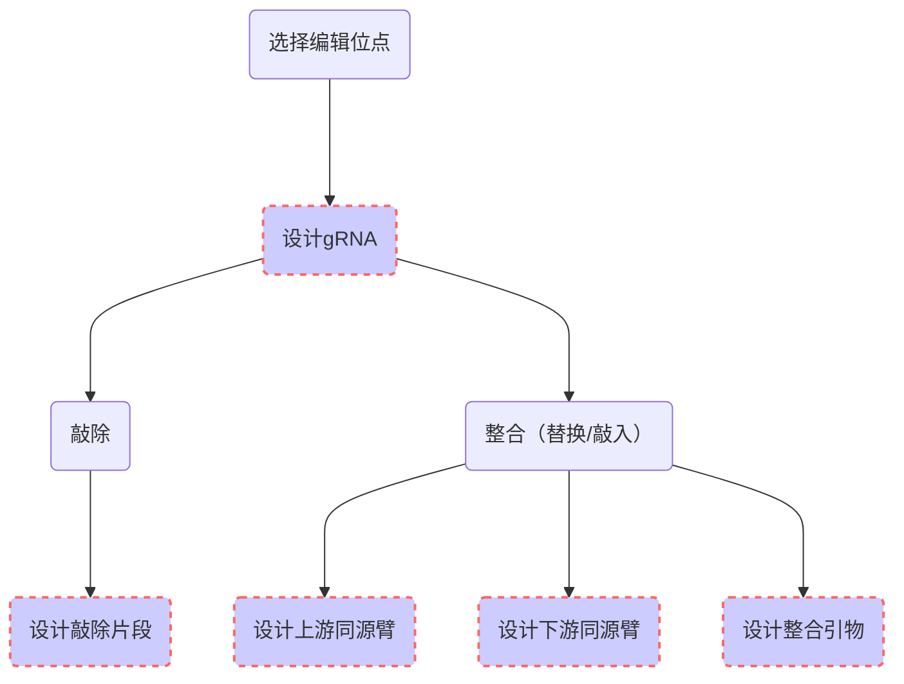

---
author:
  name: LING ld
  link: 
  avatar: ../static/avatar-girl.png

label: Background
icon: info
order: A
---

# 背景

## 1. 位点编辑逻辑



上面的流程图简要地展示了敲除、整合设计的基本逻辑。

**1）第一步：** 指定编辑区域；

**2）第二步：** 用户可以选择进行`敲除`或者`整合(替换/敲入)`设计。对目标基因进行基因组层面上的编辑（定向改造），实现特定DNA片段乃至特定DNA碱基的插入、删除、缺失、替换等，以改变目标基因的序列，从而达到特定基因的表达、调控或功能删减或增加等目的。

**3）第三步：** 红色虚线部分是需要该工具网站核心算法需要输出的结果。

- a. 对于`敲除`或者`整合(替换/敲入)`设计，都会输出对应的导向性RNA（guide RNA，gRNA）。它是一种短的RNA分子，用于基于CRISPR系统的基因组编辑，这是基因组修饰工具的一种高度特定的类型。gRNA由约20bp长的核苷酸序列组成，该序列与基因组的目标DNA序列结合。

- b. 对于`敲除`设计，则输出敲除片段的修复引物，作为在`敲除`之后发生同源修复时的模板片段。该引物需要通过PCR扩增为完整的双链DNA，在实验阶段进行基因敲除时使用。

- c. 对于`整合(替换/敲入)`设计，则需根据左右同源臂以及插入的片段设计整合引物。其中，同源修复的左、右同源臂，是物种体内遗传物质发生同源双交换引入外源片段时必须的片段，是为了在引入外源片段时细胞发生同源重组修复过程中可以精准定位到特定位置并引入外源片段的引导者片段。

在[基因敲除具体操作示例](https://ludidiya.github.io/CASdesignUserManual/instruction/parameters/#1%E6%95%B2%E9%99%A4%E5%BC%95%E7%89%A9%E5%8F%82%E6%95%B0%E8%AE%BE%E7%BD%AE)以及[基因插入/替换具体操作示例](https://ludidiya.github.io/CASdesignUserManual/instruction/parameters/#2%E6%8F%92%E5%85%A5%E7%89%87%E6%AE%B5%E5%BC%95%E7%89%A9%E5%8F%82%E6%95%B0%E8%AE%BE%E7%BD%AE)中，我们有详细的例子讲解如何使用本网站工具进行基因编辑并获取引物结果。

随后，本文将对该网站工具所依赖的算法工具进行逐一介绍。

## 2. gRNA设计 

CRISPR基因编辑技术在现代生物学中无处不在。例如，CRISPR-Cas已被用于将新序列引入基因组，激活或抑制转录，用于靶向突变，作为诊断工具等。所有的CRISPR-Cas应用都使用sgRNA将CRISPR效应蛋白定向到其靶标。为了方便CRISPR系统的广泛应用，Labun, K.等人开发了CHOPCHOP这个直观的网络工具，用于在各种应用场景下识别`CRISPR/Cas9`或`CRISPR/Cpf1`单导向RNA（sgRNA）靶标。

我们这个网页工具，在sgRNA设计部分便是整合了CHOPCHOP的部分功能。这些功能可以提高sgRNA的定位能力、可用性和效率。为了增加靶向方位和特异性，CHOPCHOP为定制长度的gRNA提供了支持，并且使用了来自多个大规模研究的模型来评估整个sgRNA及其周围区域的序列组成。具体见[参数设置](/instruction/Parameters.md)。

!!! **参考资料**

:sparkles: 1）Labun, K., Montague, T. G., Krause, M., Torres Cleuren, Y. N., Tjeldnes, H., & Valen, E. [CHOPCHOP v3: expanding the CRISPR web toolbox beyond genome editing.](https://academic.oup.com/nar/article/47/W1/W171/5491735) Nucleic Acids Research (2019).

:sparkles: 2）[CHOPCHOP网页工具](http://chopchop.cbu.uib.no/)

:sparkles: 3）[CHOPCHOP源码](https://bitbucket.org/valenlab/chopchop/src/master/)
!!!

## 3. 引物Tm计算（Primer3）

对于引物的解链温度，我们使用了以下两种近似算法：

* 对于序列长度小于`14 bp`的序列，使用如下公式:

```
Tm= (wA+xT) * 2 + (yG+zC) * 4
```

* 对于序列长度大于`13 bp`的序列，使用如下公式：

```
Tm= 64.9 +41*(yG+zC-16.4)/(wA+xT+yG+zC)
```

当序列中包含有[Degenerated nucleotides](http://www.bioinformatics.org/sms/iupac.html) （比如：Y,R,W,S,K,M,D,V,H,B 或 N）时，算法会直接将序列替换成满足Tm最大及最小时的碱基，比如：

```
Example:
Primer sequence:                       CTCTRYCTWSCTCTCT
Sequence for minimum Tm calculation:   CTCTATCTAGCTCTCT
Sequence for maximum Tm calculation:   CTCTGCCTAGCTCTCT
```

!!! **参考资料**

:sparkles: 1）上述两个公式中，`w`、`x`、`y`、`z` 分别表示序列中 `A`、`T`、`G`、`C`碱基数。

:sparkles: 2）**假设：** 上述方程假设退火发生在50nM引物、50mM Na+和pH 7.0的标准条件下。

!!!

## 4. 序列可视化

序列可视化使用的是[Open Vector Editor](https://github.com/TeselaGen/openVectorEditor)这一开源工具，它支持小片段DNA序列（非基因组序列）的可视化、注释，并方便用户在此界面直观地进行交互式基因编辑操作。

此界面主要以`Linear Map`和`Sequence Map`两部分组成，如下图所示：


