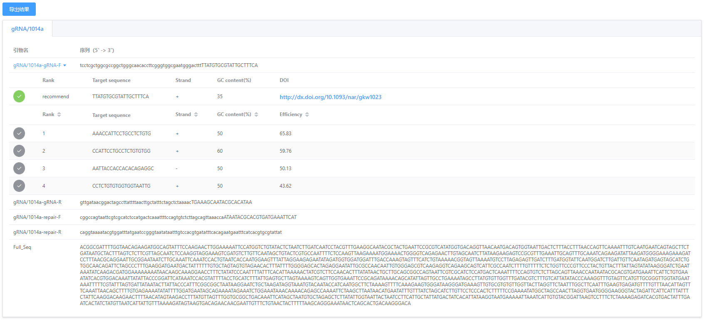

---
author:
  name: 
  link: 
  avatar: ../static/avatar-girl.png

label: Verified Sites
icon: checklist
order: G
---

# 表征位点管理

除基因组中原本注释的基因位点，对于长期被研究人员研究的模式菌株，有很多经实验验证过的高效功能位点，如高效率、高特异性的sgRNA，调控基因表达的promoter区等。为用户方便快速检索到这些已表征过的功能位点，本软件可针对任意基因组添加这些位点的信息。

!!! **注意**

:sparkles: 仅管理员有权限添加功能位点。当您有需要时，请联系管理员进行位点增加。

!!!

位点成功增添后，用户可在`选择位置——搜索特征名称`处检索到表征位点。

下面介绍摘自[Amanda](https://academic.oup.com/nar/article/45/1/496/2572058#)等人报道的，`sacCer3_S288C`基因组中的23个sgRNA位点信息。

## 1. pCut Plasmid Toolkit

### 1）描述

This toolkit of 27 plasmids contains high-efficiency, Cas9-sgRNA (pCut) plasmids for integrating into 23 well-characterized loci, across all 16 yeast chromosomes. The gRNA sequence can be easily exchanged to target additional loci and enable deletion or replacement of genes.

### 2）Cas9-sgRNAs

|	**chr** |	**Locus Name** |	**start** |	**end** |	**Sequence (5'—>3')** |
|:---:|:---:|:---:|:---:|:---:|
| 1	| gRNA/106a	| 70960	| 70979	| ATACGGTCAGGGTAGCGCCC |
| 2	| gRNA/208a	| 237441	| 237460	| GTCCGCTAAACAAAAGATCT |
| 3	| gRNA/RDS1a	| 310400	| 310419	| ATTCAATACGAAATGTGTGC |
| 3	| gRNA/308a	| 114130	| 114149	| CACTTGTCAAACAGAATATA |
| 4	| gRNA/416d	| 463126	| 463145	| TAGTGCACTTACCCCACGTT |
| 5	| gRNA/511b	| 33261	| 33280	| CAGTGTATGCCAGTCAGCCA |
| 5	| gRNA/CAN1y	| 174990	| 175009	| GATACGTTCTCTATGGAGGA |
| 6	| gRNA/SAP155c	| 199670	| 199689	| ATGAAAGACAACTATAGGGC |
| 6	| gRNA/SAP155b	| 233804	| 233823	| GGTTTTCATACTGGGGCCGC |
| 6	| gRNA/607c	| 237073	| 237092	| CTATTTTTGCTTTCTGCACA |
| 7	| gRNA/720a	| 508439	| 508458	| CAACAATTGTTACAATAGTA |
| 8	| gRNA/805a	| 64214	| 64233	| TTATTTGAATGATATTTAGT |
| 9	| gRNA/911b	| 136440	| 136459	| GTAATATTGTCTTGTTTCCC |
| 10	| gRNA/1021b	| 417112	| 417131	| CCTCTGTGTGGTGGTAATTG |
| 10	| gRNA/1014a	| 683537	| 683556	| TTATGTGCGTATTGCTTTCA |
| 11	| gRNA/1114a	| 448385	| 448404	| CTTGTGAAACAAATAATTGG |
| 12	| gRNA/1206a	| 91884	| 91903	| CGAACATTTTTCCATGCGCT |
| 13	| gRNA/1309a	| 262867	| 262886	| CCTGTGGTGACTACGTATCC |
| 14	| gRNA/1414a	| 280250	| 280269	| GCGCCACAGTTTCAAGGGTC |
| 15	| gRNA/HIS3b	| 3233	| 3252	| AATATAGAGTGTACTAGAGG |
| 15	| gRNA/YOLCdelta1	| 721755	| 721774	| CTAGAATTTCCATTTTGCGT |
| 16	| gRNA/YPRCdelta15c	| 562256	| 562275	| AATCCGAACAACAGAGCATA |
| 16	| gRNA/1622b	| 776883	| 776902	| TAAAGCCACCACATCGCAAA |

!!! **参考资料**

:sparkles: 1）Amanda Reider Apel, Leo d'Espaux, Maren Wehrs, Daniel Sachs, Rachel A. Li, Gary J. Tong, Megan Garber, Oge Nnadi, William Zhuang, Nathan J. Hillson, Jay D. Keasling, Aindrila Mukhopadhyay, [A Cas9-based toolkit to program gene expression in Saccharomyces cerevisiae](https://academic.oup.com/nar/article/45/1/496/2572058#), Nucleic Acids Research, Volume 45, Issue 1, January 2017, Pages 496–508.
!!!

## 2. sgRNA推荐

不论用户以哪种方式选择编辑位点，只要最终在可视化编辑页，被敲除或替换的区域包含了上述列表中的sgRNA区域，则会在结果页面中推荐给用户。