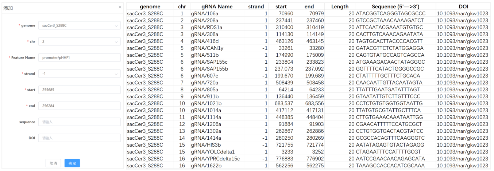
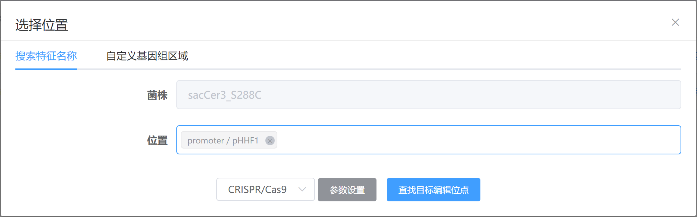

---
author:
  name: 
  link: 
  avatar: ../static/avatar-girl.png

label: Add features
icon: checklist
order: G
---

# 表征位点管理

除基因组中原本注释的基因位点，对于长期被研究人员研究的模式菌株，有很多经实验验证过的高效功能位点，如高效率、高特异性的sgRNA，调控基因表达的promoter区等。为用户方便快速检索到这些已表征过的功能位点，本软件可针对任意基因组添加这些位点的信息。

!!! **注意**

:sparkles: 仅管理员有权限添加功能位点。

:sparkles: 当普通用户有位点需要添加到指定基因组时，可按照下图将字段信息填写进Excel表发送给管理员(ld.ling@siat.ac.cn)。

!!!

位点成功增添后，用户可在`选择位置——搜索特征名称`处通过检索位点名称，靶向选择到指定的位点。

