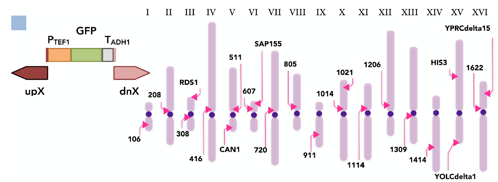

---
author:
  name: 
  link: 
  avatar: ./static/avatar-girl.png

label: Verified gRNAs
icon: checklist
order: G
---

## 1. pCut Plasmid Toolkit

### 1）描述

Our toolkit of 27 plasmids contains high-efficiency, Cas9-sgRNA (pCut) plasmids for integrating into 23 well-characterized loci, across all 16 yeast chromosomes. The gRNA sequence can be easily exchanged to target additional loci and enable deletion or replacement of genes.

### 2）Verified sgRNAs

| **Chromosome** |	**Locus name** |	**Target Sequence** |
|:---:|:---:|:---:|
|chr1 |	106a |	ATACGGTCAGGGTAGCGCCC |
|chr2 |	208a |	GTCCGCTAAACAAAAGATCT |
|chr3 |	RDS1a |	ATTCAATACGAAATGTGTGC |
|chr3 |	308a |	CACTTGTCAAACAGAATATA |
|chr4 |	416d |	TAGTGCACTTACCCCACGTT |
|chr5 |	511b |	CAGTGTATGCCAGTCAGCCA |
|chr5 |	CAN1y |	GATACGTTCTCTATGGAGGA |
|chr6 |	SAP155c |	ATGAAAGACAACTATAGGGC |
|chr6 |	SAP155b |	GGTTTTCATACTGGGGCCGC |
|chr6 |	607c |	CTATTTTTGCTTTCTGCACA |
|chr7 |	720a |	CAACAATTGTTACAATAGTA |
|chr8 |	805a |	TTATTTGAATGATATTTAGT |
|chr9 |	911b |	GTAATATTGTCTTGTTTCCC |
|chr10 |	1021b |	CCTCTGTGTGGTGGTAATTG |
|chr10 |	1014a |	TTATGTGCGTATTGCTTTCA |
|chr11 |	1114a |	CTTGTGAAACAAATAATTGG |
|chr12 |	1206a |	CGAACATTTTTCCATGCGCT |
|chr13 |	1309a |	CCTGTGGTGACTACGTATCC |
|chr14 |	1414a |	GCGCCACAGTTTCAAGGGTC |
|chr15 |	HIS3b |	AATATAGAGTGTACTAGAGG |
|chr15 |	YOLCdelta1b |	CTAGAATTTCCATTTTGCGT |
|chr16 |	YPRCdelta15c |	AATCCGAACAACAGAGCATA |
|chr16 |	1622b |	TAAAGCCACCACATCGCAAA |

!!! **参考资料**

:sparkles: 1）Amanda Reider Apel, Leo d'Espaux, Maren Wehrs, Daniel Sachs, Rachel A. Li, Gary J. Tong, Megan Garber, Oge Nnadi, William Zhuang, Nathan J. Hillson, Jay D. Keasling, Aindrila Mukhopadhyay, [A Cas9-based toolkit to program gene expression in Saccharomyces cerevisiae](https://academic.oup.com/nar/article/45/1/496/2572058#), Nucleic Acids Research, Volume 45, Issue 1, January 2017, Pages 496–508.
!!!